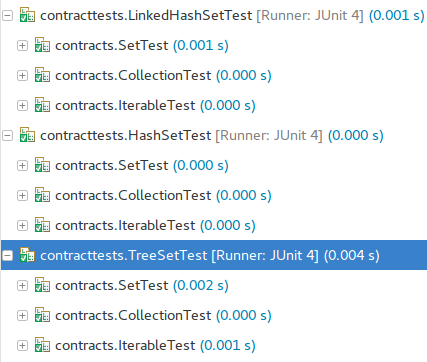
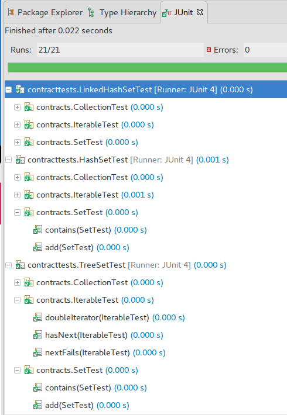

junit-contracts: A suite of tools to make contract testing easier 
=================================================================

Overview
--------

Contract tests allow developers to verify implementations of interfaces meet the requirements of the interface designer.  In java this can be problematic due to its single inheritance nature.  This package is a <a href="http://junit.org/junit4/">junit 4</a> based implementation of a contract testing framework.  This means that it runs within junit without modification.

Multiple `@Contract`s can be defined for multiple interfaces, and for each `@ContractImpl`,
junit-contract will run the suite of all the matching contract tests:




Tutorials and Presentations
---------------------------

<a href="http://events.linuxfoundation.org/sites/events/files/slides/cloudstack.pdf">Junit-contracts: A Contract Testing Tool</a>, presented at CloudStack Collaboration Conference Europe, October 8-9, 2015, Dublin, Ireland. <a href="https://www.youtube.com/watch?v=WRf-RwWxf-w">Video available on YouTube</a>.

<a href="http://www.drdobbs.com/testing/simplifying-contract-testing/240167128">Simplifying Contract Testing</a>. Claude N. Warren, Jr., in Dr. Dobb's Journal, May 06, 2014.

Also see "How It Works" below.

Maven Repository Info 
---------------------

Release version

     Group Id: org.xenei 
     Artifact Id: contracts 

Snapshot versions are hosted at:

     https://oss.sonatype.org/content/repositories/snapshots/

Modules 
=======

The contracts project comprises three modules: junit-contracts, contract-test-maven-plugin and contract-cmdline.

junit-contracts
---------------

<a href="./junit">junit-contracts</a> is the module that encompasses the annotations and junit test
runners to execute the connection tests.

Release version

     Group Id: org.xenei 
     Artifact Id: junit-contracts 

contract-test-maven-plugin
--------------------------

<a href="./maven/">maven-contracts</a> is the module that encompasses the maven plugin that will report results and errors from running the tests.

Release version

     Group Id: org.xenei 
     Artifact Id: contract-test-maven-plugin 

contracts-cmdline
-----------------

<a href="./cmdLine/">contracts-cmdline</a> is the model that encompasses the command line tools that will generate reports equivalent to the maven contracts plugin.

Release version

     Group Id: org.xenei 
     Artifact Id: contract-cmd-line 

Class Filters
=============

The junit-contracts module uses the <a href="https://github.com/Claudenw/classpath-utils">classpath-utils</a> project to discover and filter classes on the classpath.  Included in this package is the ClassFilter class which is patterned after the Java FileFilter class. 

Class filters are constructed in the maven and command line modules via strings.  Each string is the string representation of a filter.  For example: _Not( Wildcard( "*Test*" ) )_ will match any class name that does not have the string "test".  For more information see the <a href="https://github.com/Claudenw/classpath-utils">Class Filters</a> section of the classpath-utils documentation. 

Contract Tests 
==============

Contract tests test the contract defined by a Java interface and the associated documentation.  The interface defines the method signatures, but the documentation often expands upon that to define the behaviour that the interface is expected to perform. For example, the Map interface defines put(), get(), and remove().  But the human readable documentation tells the developer that if you put() an object you must be able to get() it unless the remove() has been called.  That last statement defines two tests in the contract test.

The basic argument for the use of contract tests is that you can prove code correctness.  That is, if every object interface is defined as an interface, every interface has a contract test that covers all methods and their expected operation, and all objects have tests that mock the objects they call as per the interface definition - then running the entire suite of tests demonstrates that the interconnection between each object works.

If we know that _A_ calls _B_ properly and _B_ calls _C_ properly then we can infer that _A_ calls _C_ properly.  We can, with some work, prove that the code is correct.

Contract tests will not discover misconfiguration.  For example, if class _A_ uses a map and expects a map that can accept null keys but the configuration specifies a map implementation that does not accept null keys, the contract test will not detect the error.  But then the error is a configuration error caused by a missing requirement for the configuration.

For more information on contract tests see

http://www.infoq.com/presentations/integration-tests-scam

http://www.jbrains.ca/permalink/interlude-basic-correctness

How it Works 
============

         A
         |
      ---+---.  
      |      |
      A1     A2

Most JUnit tests work vertically.  Originally they were all derived from a test class, and since version 4 they use annotations to identify a method as a test.  However, they only work in the direct hierarchy of class inheritance. That is, if classes _A1_ and _A2_ are derived from class _A_ and tests _A1Test_ and _A2Test_ are derived from _ATest_ then all the _ATest_ unit tests will be executed when _A1Test_ and _A2Test_ are run.  However, with the use of interfaces there arises an orthogonal testing problem.

         A
         |
      ---+---.  
      |      |
      A1(I)  A2  B(I)

If we add interface _I_ to our class structure and define _A1_ as implementing _I_ and a new class _B_ as implementing _I_, then both _A1_ and _B_ require the _I_ tests, but they have no classes in common in the hierarchy.  Therefore the tests for _A1_ and _B_ must implement them - this violates the Don't-Repeat-Yourself (DRY) principle and will lead to problems if _I_ changes and the _A1_ and _B_ tests are not modified as well.

The ContractSuite solves this problem by requiring the following additions:

* an abstract test class _ITest_ for the interface _I_, that is annotated with the __@Contract( I.class )__.  
* a contract test suite that is annotated with __@RunWith( ContractSuite.class )__ and implements method annotated with __@Contract.Inject__ that creates a Producer.

Then when executing the suite: 
* discovers all of the __@Contract__ mappings between tests and interfaces. 
* finds all the implemented interfaces of the object under test and adds their contract tests to the suite. 
* executes the completed suite.

The result is that every class that has a contract suite defined will verify that its implementation of the interface is correct as per the
contract test.  If the contract test changes, the class test will use the new contract test implementation.

Samples and Examples
====================

The test code contains a number of examples and is well [documented]
(https://github.com/Claudenw/junit-contracts/tree/master/junit/src/test/java/org/xenei/junit/contract/exampleTests) for use as such.

The [sample code](https://github.com/Claudenw/junit-contracts/tree/master/src/examples) includes the concrete tests in the Motivation section below.

Motivation
----------

Here's an example of how using junit-contracts one could organize tests for interfaces like 
[java.util.Set](https://docs.oracle.com/javase/8/docs/api/java/util/Set.html) and friends. Normally
you would write the `@Contract`s for your own interfaces, but we'll use the JDK provided
interfaces as an example as they are fairly well known.

With junit-contract we can write tests for each interface separately, providing 
a `@Contract.Inject` setter for the implementation to be tested:


```java
import static org.junit.Assert.*;
import java.util.Collection;
import java.util.NoSuchElementException;

import org.junit.After;
import org.junit.Before;
import org.xenei.junit.contract.Contract;
import org.xenei.junit.contract.ContractTest;
import org.xenei.junit.contract.IProducer;

@Contract(Iterable.class)
public class IterableTest {
	private IProducer<Iterable<Object>> producer;
	private Iterable<Object> it;

	@Contract.Inject
	public void setIterable(IProducer<Iterable<Object>> producer) {
		this.producer = producer;
	}

	@Before
	public void populate() {
		it = producer.newInstance();
	}

	@After
	public void cleanup() {
		producer.cleanUp();
	}

	@ContractTest
	public void hasNext() throws Exception {
		assertFalse(it.iterator().hasNext());
	}

	@ContractTest
	public void doubleIterator() throws Exception {
		it.iterator();
		it.iterator();
	}

	@ContractTest
	public void nextFails() throws Exception {
		try {
			it.iterator().next();
			fail("Didn't throw NoSuchElementException");
		} catch (NoSuchElementException ex) {
			// expected
		}
	}
}
```

```java
package contracts;

import static org.junit.Assert.*;
import java.util.Collection;

import org.junit.After;
import org.junit.Before;
import org.xenei.junit.contract.Contract;
import org.xenei.junit.contract.ContractTest;
import org.xenei.junit.contract.IProducer;

@Contract(Collection.class)
public class CollectionTest {

	private IProducer<Collection<Object>> producer;
	private Collection<Object> c;

	@Contract.Inject
	public void setCollection(IProducer<Collection<Object>> producer) {
		this.producer = producer;
	}

	@Before
	public void populate() {
		c = producer.newInstance();
	}

	@After
	public void cleanup() {
		producer.cleanUp();
	}

	@ContractTest
	public void empty() throws Exception {
		assertTrue(c.isEmpty());
	}

	@ContractTest
	public void size() throws Exception {
		assertEquals(0, c.size());
	}
}
```

This means we can keep separation of concern - we are not requiring `CollectionTest` to subclass `IterableTest`. Let's see why this is useful:

```java
package contracts;

import static org.junit.Assert.*;
import java.util.Set;

import org.junit.After;
import org.junit.Before;
import org.xenei.junit.contract.Contract;
import org.xenei.junit.contract.ContractTest;
import org.xenei.junit.contract.IProducer;

@Contract(Set.class)
public class SetTest {

    private IProducer<Set<Object>> producer;
    private Set<Object> c;

    @Contract.Inject
    public void setSet(IProducer<Set<Object>> producer) {
        this.producer = producer;

    }

    @Before
    public void populate() {
        c = producer.newInstance();
        c.add("Hello");
    }

    @After
    public void cleanup() {
    	producer.cleanUp();
    }
     
    @ContractTest
    public void contains() throws Exception {
        assertTrue(c.contains(("Hello")));
        assertFalse(c.contains("World"));
    }

    @ContractTest
    public void add() throws Exception {
        c.add("World");
        assertTrue(c.contains("World"));
    }
}
```

The above `SetTest` can't subclass `CollectionTest` because it has a `@Before` method that populates the set - this would break `CollectionTest.empty()` which expects an empty collection. With junit-contracts each `@Contract` is executed in isolation and don't share state with the other tests.

So let's test it with [HashSet](https://docs.oracle.com/javase/8/docs/api/java/util/HashSet.html):

```java
package contracttests;

import java.util.HashSet;
import org.junit.runner.RunWith;
import org.xenei.junit.contract.Contract;
import org.xenei.junit.contract.ContractImpl;
import org.xenei.junit.contract.ContractSuite;
import org.xenei.junit.contract.IProducer;

@RunWith(ContractSuite.class)
@ContractImpl(HashSet.class)
public class HashSetTest {

	IProducer<HashSet<Object>> producer = new IProducer<HashSet<Object>>() {
		public HashSet<Object> newInstance() {
			return new HashSet<Object>();
		}

		public void cleanUp() {
			// no cleanup required.
		}
	};

	@Contract.Inject
	public IProducer<HashSet<Object>> makedashSet() {
		return producer;
	}
}
```

and with [LinkedHashSet](https://docs.oracle.com/javase/8/docs/api/java/util/LinkedHashSet.html):

```java
package contracttests;

import java.util.LinkedHashSet;
import org.junit.runner.RunWith;
import org.xenei.junit.contract.Contract;
import org.xenei.junit.contract.ContractImpl;
import org.xenei.junit.contract.ContractSuite;
import org.xenei.junit.contract.IProducer;

@RunWith(ContractSuite.class)
@ContractImpl(LinkedHashSet.class)
public class LinkedHashSetTest {

	IProducer<LinkedHashSet<Object>> producer = new IProducer<LinkedHashSet<Object>>() {
		public LinkedHashSet<Object> newInstance() {
			return new LinkedHashSet<Object>();
		}

		public void cleanUp() {
			// no cleanup required.
		}
	};

	@Contract.Inject
	public IProducer<LinkedHashSet<Object>> makedashSet() {
		return producer;
	}
}
```

Running the above two Tests will execute all the matching `@Contract` tests.  This means we can have "optional" tests by interface:


```java
package contracts;

import static org.junit.Assert.*;
import java.util.SortedSet;

import org.junit.After;
import org.junit.Before;
import org.xenei.junit.contract.Contract;
import org.xenei.junit.contract.ContractTest;
import org.xenei.junit.contract.IProducer;

@Contract(SortedSet.class)
public class SortedSetTest {

	private IProducer<SortedSet<Object>> producer;
	private SortedSet<Object> c;

	@Contract.Inject
	public void setSet(IProducer<SortedSet<Object>> producer) {
		this.producer = producer;
	}

	@Before
	public void populate() {
		c = producer.newInstance();
		// Deliberately not added in order
		c.add("c");
		c.add("a");
		c.add("b");
	}

	@After
	public void cleanup() {
		producer.cleanUp();
	}

	@ContractTest
	public void first() throws Exception {
		assertEquals("a", c.first());
	     assertEquals("c", c.last());
    }
}
```

This has a separate, incompatible `@Before` method that is otherwise hard to align with `SetTest`. We'll test it with [TreeSet](https://docs.oracle.com/javase/8/docs/api/java/util/TreeSet.html):


```java
package contracttests;
import java.util.HashSet;
import java.util.TreeSet;
import org.junit.runner.RunWith;
import org.xenei.junit.contract.Contract;
import org.xenei.junit.contract.ContractImpl;
import org.xenei.junit.contract.ContractSuite;
import org.xenei.junit.contract.IProducer;

@RunWith(ContractSuite.class)
@ContractImpl(TreeSet.class)
public class TreeSetTest {
 
    IProducer<TreeSet<Object>> producer = new IProducer<TreeSet<Object>>() {
    	public TreeSet<Object> newInstance() {
    		return new TreeSet<Object>();
    	}
    	
    	public void cleanUp() {
    		// no cleanup required.
    	}
    };
    
    @Contract.Inject
    public IProducer<TreeSet<Object>> makedashSet() {
        return producer;        
    }
}
```

With junit-contracts we can now run all the combinations of tests that are possible for each of the `@ContractImpl`, which would run in isolation:



Why The IProducer
-----------------

In the examples above the IProducer construct seems unnecessary, and in fact the tests can be written to inject an instance of the object under test.  However, the IProducer interface provides a mechanism for the contract test to ensure that any resources allocated when the object was created is released.  It also provides a mechanism whereby a test may use 2 or more instances of the object during the test.  In our simple examples above this is not evident.  If we were to have a database backed Set implementation then the cleanup could reset the database tables to a known state as is illustrated below.

DBSet definition:

```java
package contracttests;
import java.sql.Connection;
import java.sql.Statement;

public class DBSet<T> implements Set<T> {
 

	Statement stmt;
	
	public DBSet( Connection conn )
	{
		this.stmt = conn.createStatement();
	}
	
	public void close() {
		this.stmt.close();
		this.stmt = null;
	}
	
	// implementation left to the reader	
}
```
Contract Test for DBSet

```java
package contracttests;
import java.sql.Connection;
import org.junit.runner.RunWith;
import org.xenei.junit.contract.Contract;
import org.xenei.junit.contract.ContractImpl;
import org.xenei.junit.contract.ContractSuite;

@RunWith(ContractSuite.class)
@ContractImpl(DBSet.class)
public class DBSetTest {
 
 	String URL = "jdbc:oracle:thin:@amrood:1521:EMP";
    String USER = "username";
	String PASS = "password"
	Connection conn = DriverManager.getConnection(URL, USER, PASS);
	List<DBSet<Object>> openedDbSets;

    IProducer<DBSet<Object>> producer = new IProducer<DBSet<Object>>() {
    	public DBSet<Object> newInstance() {
    		DBSet<Object> dbSet = DBSet<Object>(connection);
    		openedDbSets.add( dbSet );
    		return dbSet;
    	}
    	
    	public void cleanUp() {
    		for (DBSet<Object> : openedDbsets )
    		{
    			// empty the database table
    			dbSet.clear();
    			// close the connection
    			dbSet.close();
    		}
    	}
    }
    
    @Contract.Inject
    public Producer<TreeSet<Object>> makedashSet() {
        return producer;        
    }
}
```

Annotations
===========

Contract
--------

Indicates that the class is a contract test.  The argument is the class that is being tested.

Contract.Inject
---------------

Indicates that the method is a getter that provides the IProducer to inject or a setter that accepts the IProducer.

ContractImpl
------------

Identifies the implementation class that is being tested.  

ContractImpl has two attributes that can remove tests.

* skip is an array of interface classes that should not be tested.  All contract tests for the interfaces will be skipped.

* ignore list any @Contract annotated tests that should be ignored.  This allows removal of broken
tests that are outside the control of the developer of the @ContractImpl test.

ContractExclude
---------------

ContractExclude is intended to be used with @ContractImpl.  The annotation has 2 arguments
1. value is the name of the class that contains the test to exclude.
2. methods is a list of method names in the test class to exclude.

This annotation will remove the tests only for the ContractImpl it is associated with.

ContractTest
------------

Like a JUnit Test annotation but requires that the test be run within the ContractSuite runner.  Contract tests may be annotated with the standard JUnit @Ignore annotation to disable the test for all contract suites. 

Dynamic.Inject
--------------

Used with Dynamic implementation to specify the class to inject.  The Dyanamic suite is used to create a test suite from the return values of a class.  This provides a mechanism to test Factory and similar class types.

NoContractTest
--------------

Indicates that an interface should not have a contract test.  This is used to remove interfaces from the reporting when a test is not expected or possible.
